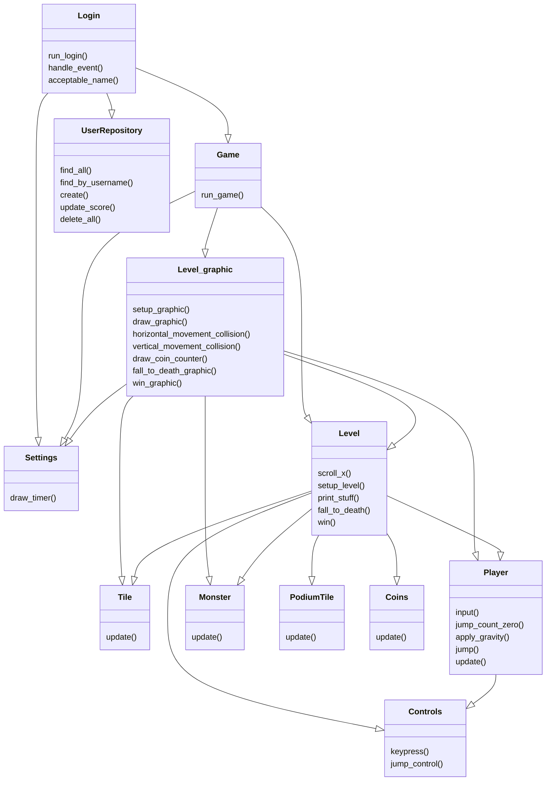

# Arkkitehtuurikuvaus

## Rakenne

Ohjelman rakenteessa on itse pelin varsinainen koodi, sekä data ja spirtes-luokat. data-luokassa on tallennettuna pelin tulokset sql-tietokantaan, ja sprites-kansiossa ladattavat grafiikat

## Käyttöliittymä

Pelin käyttöliittymässä on neljä eri näkymää:
- Pelin aloitusruutu
- Nimen valitseminen
- itse peli
- voitto- ja tulosruutu

Kaikki näkymistä paitsi voittoruutu ovat omia luokkiaan, ja kaikki ovat toteutettuja pygamen avulla. Näkymät näkyvät ruudulla yksi kerrallaan ja niistä siirrytään toiseen osittain nappien kautta. Käyttöliittymää on pyritty eristämään sovelluslogiikasta.
Näkymistä toinen eli nimen valinta päivittyy jatkuvasti syötteen perusteella, ja antaa käyttäjälle neuvoja.
Itse pelinäkymä päivittyy jatkuvasti pelin edetessä.
Käyttöliittymä sisältää luokkia, kuten menu, login_menu sekä levels_2_graphic

## Sovelluslogiikka
Sovelluslogiikka sisältää useita luokkia, joista tärkeimmät ovat levels_2 sekä game. levels_2 vastaa itse pelikentän toiminnasta, ja game pyörittää koko peliä. 

## Tietojen pysyväistallennus
Pelissä pelaajan nimet sekä saavutetut tulokset tallennetaan SQLite-tietokantaan. Voittaessa tästä tietokannasta haetaan tulokset. tärkeitä ovat tiedostot database_connection, initialize_database sekä scores, jotka käsittelevät tietokantaa niin kirjoittamiseen kuin lukemiseen.
## Tiedostot
SQLite-tietokanta Users tallennetaan kansion data tiedostoon database.db. Sinne tallenetaan pelaajan nimi sekä kunkin nimen paras saavutettu tulos. 

