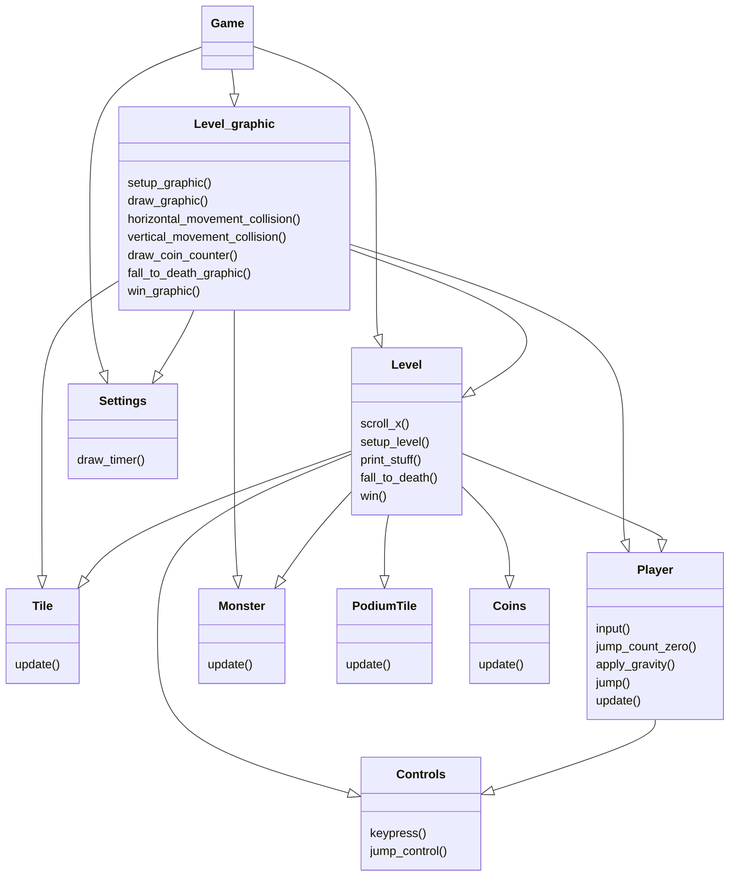

```mermaid
classDiagram
  Game--|>Level
  Game--|>Level_graphic
  Game--|>Settings
  Level_graphic--|>Level
  Level_graphic--|>Tile
  Level_graphic--|>Settings
  Level_graphic--|>Player
  Level_graphic--|>Monster
  Level--|>Monster
  Level--|>Player
  Level--|>Tile
  Level--|>PodiumTile
  Level--|>Coins
  Level--|>Controls
  Player--|>Controls


  class Level_graphic{
    setup_graphic()
    draw_graphic()
    horizontal_movement_collision()
    vertical_movement_collision()
    draw_coin_counter()
    fall_to_death_graphic()
    win_graphic()
    
  
  }
  
  
  class Level{
    scroll_x()
    setup_level()
    print_stuff()
    fall_to_death()
    win()

    

  }

  class Player{
    input()
    jump_count_zero()
    apply_gravity()
    jump()
    update()

  }

  class Monster{
    update()

  }

  class Tile{
    update()

  }

  class PodiumTile{
    update()

  }
  

  class Coins{
    update()

  }
  

  class Controls{
    keypress()
    jump_control()

  }
  

  class Settings{
    draw_timer()

  }
```
