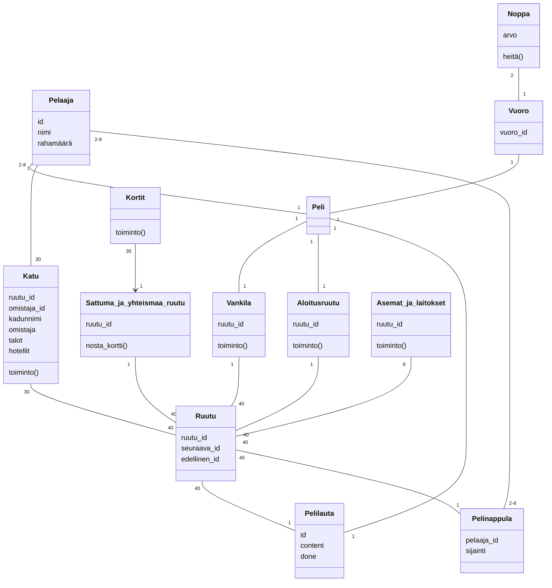

```mermaid
 classDiagram
      Pelaaja "2-8" -- "1" Peli
      Vuoro "1" -- "1" Peli
      Pelilauta "1" -- "1" Peli
      Noppa "2" -- "1" Vuoro
      Pelinappula "2-8" -- "2-8" Pelaaja
      Ruutu "40" -- "1" Pelilauta
      Ruutu "40" -- "1" Pelinappula
      Aloitusruutu "1" -- "40" Ruutu
      Vankila "1" -- "40" Ruutu
      Sattuma_ja_yhteismaa_ruutu "1" -- "40" Ruutu
      Kortit "30" --> "1" Sattuma_ja_yhteismaa_ruutu
      Katu "30" -- "40" Ruutu
      Asemat_ja_laitokset "6" -- "40" Ruutu
      Peli "1" -- "1" Vankila
      Peli "1" -- "1" Aloitusruutu
      Pelaaja "1" -- "30" Katu
      
      
      class Peli{
      }
      class Vuoro{
          vuoro_id
      }
      class Noppa{
          arvo
          heitä()
      }
      class Pelaaja{
          id
          nimi
          rahamäärä
      }
      class Pelinappula{
          pelaaja_id
          sijainti
      }
      class Pelilauta{
          id
          content
          done
      }
      class Ruutu{
          ruutu_id
          seuraava_id
          edellinen_id
      }
      class Aloitusruutu{
          ruutu_id
          toiminto()
      }
      class Vankila{
          ruutu_id
          toiminto()
      }
      class Sattuma_ja_yhteismaa_ruutu{
          ruutu_id
          nosta_kortti()
      }
      class Kortit{
          toiminto()
      }
          
      class Asemat_ja_laitokset{
          ruutu_id
          toiminto()
      }
      class Katu{
          ruutu_id
          omistaja_id
          kadunnimi
          omistaja
          talot
          hotellit
          toiminto()
      }
      
```
