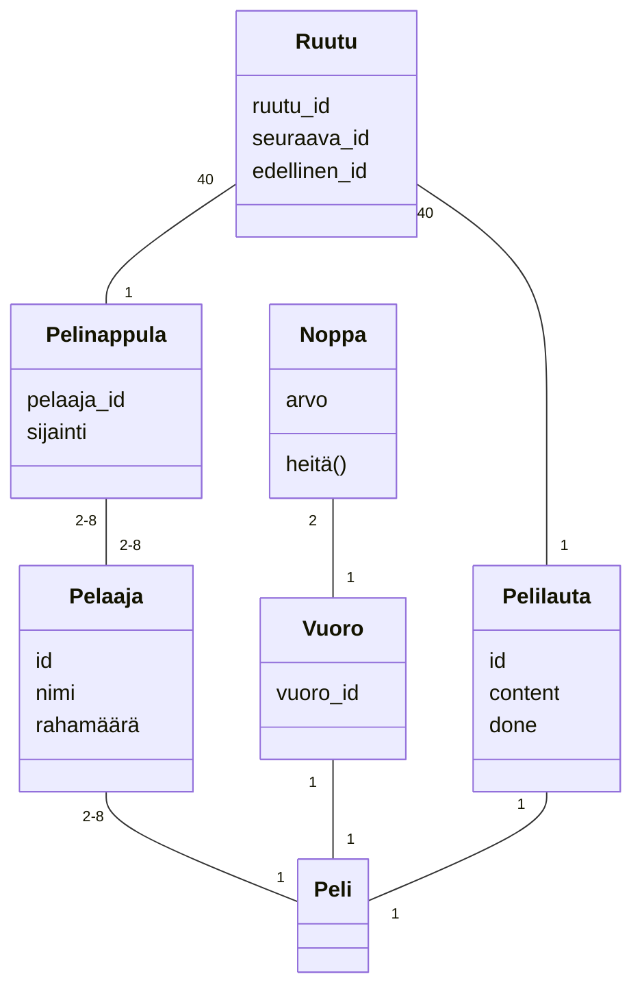

```mermaid
 classDiagram
      Pelaaja "2-8" -- "1" Peli
      Vuoro "1" -- "1" Peli
      Pelilauta "1" -- "1" Peli
      Noppa "2" -- "1" Vuoro
      Pelinappula "2-8" -- "2-8" Pelaaja
      Ruutu "40" -- "1" Pelilauta
      Ruutu "40" -- "1" Pelinappula
      
      
      class Peli{
      }
      class Vuoro{
          vuoro_id
      }
      class Noppa{
          arvo
          heitä()
      }
      class Pelaaja{
          id
          nimi
          rahamäärä
      }
      class Pelinappula{
          pelaaja_id
          sijainti
      }
      class Pelilauta{
          id
          content
          done
      }
      class Ruutu{
          ruutu_id
          seuraava_id
          edellinen_id
          
      }
```
