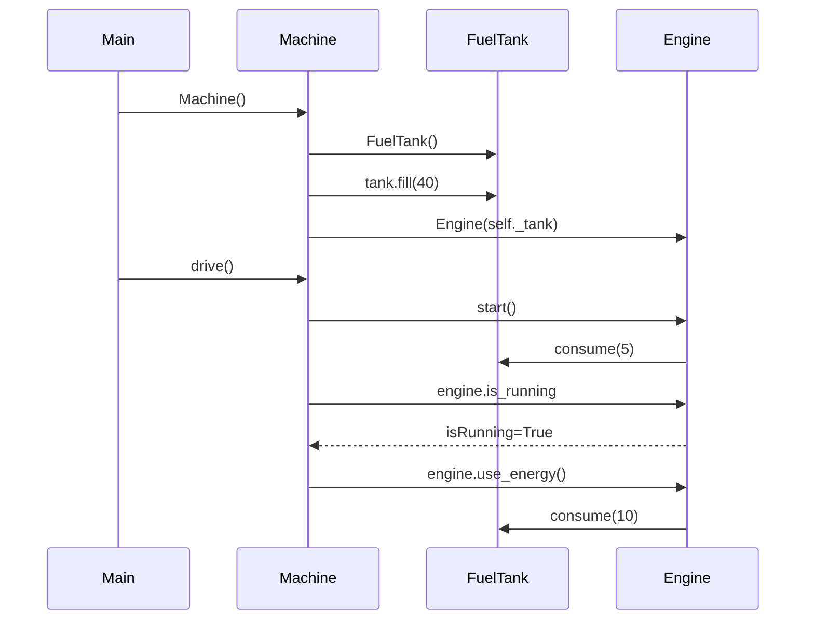

```mermaid
    sequenceDiagram
        Main->>Machine: Machine()
        Machine->>FuelTank: FuelTank()
        Machine->>FuelTank: tank.fill(40)
        Machine->>Engine: Engine(self._tank)
        Main->>Machine: drive()
        Machine->>Engine: start()
        Engine->>FuelTank: consume(5)
        Machine->>Engine: engine.is_running
        Engine-->>Machine: isRunning=True
        Machine->>Engine: engine.use_energy()
        Engine->>FuelTank: consume(10)
        
        
        
        
        
```
